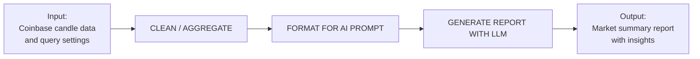
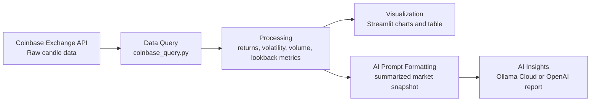

# AI Reporter: Process Diagram and Stakeholder Mapping

## Stage 1: Process Diagram

## Full System Data Flow

### Inputs

- Raw Coinbase spot candle data
- User-selected settings such as product, granularity, and lookback window
- Prompt instructions for the AI summary

### Steps

- `CLEAN / AGGREGATE`: organize the API data and compute metrics such as returns, volatility, and volume
- `FORMAT FOR AI PROMPT`: turn the processed market data into a structured text or JSON-style prompt
- `GENERATE REPORT WITH LLM`: send the prompt to Ollama or OpenAI and request a short written summary

### Outputs

- AI-generated market report
- Clear summary of price movement, volatility, and trading activity

## Stage 2: Stakeholder -> Goal Mapping

- Student needs a fast way to turn market data into a readable summary -> the system generates a concise AI-written report from processed Coinbase data.
- Instructor needs evidence that the workflow combines API querying, data processing, and AI reporting -> the system links those steps in one reproducible pipeline.
- User needs market information in plain language instead of raw numbers -> the system converts computed metrics into a short narrative explanation.
- User needs flexible reporting for different markets and time windows -> the system accepts product, granularity, and lookback settings as inputs.
- User needs output that can be submitted or shared easily -> the system produces a report that can be displayed, copied, or saved in report-friendly formats.
